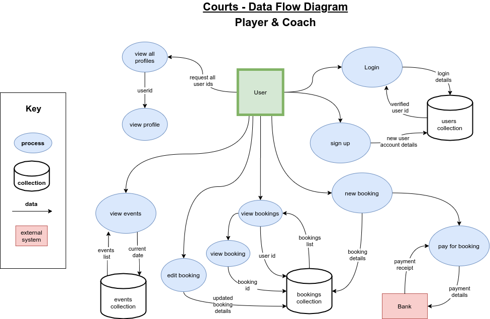

# T3A2-A - Full Stack App (Part A)

## Hugh & Luke

----------

### Purpose
***Courts*** is a simple to use booking application designed for a local tennis court business. It was developed to replace their previous system that relied on phone bookings and cash envelopes.

##### Client Requirements

- Simple, easy to use UI 
- online payments
- Ability for coaches to advertise lessons on a member noticeboard
- Admin functions to: 
  - post events on a member noticeboard
  - create, edit and delete any bookings

### Functionality / Features
There are 3 types of user accounts: Player, Coach and Admin. 

### Target audience

The target audience are the players and coaches that use the tennis court as well as the admin staff who run the court.

### Tech stack (explain what each part of the tech stack is doing)

##### NodeJS 
NodeJS is a JavaScript runtime environment that allows JavaScript code to be run on the server. It powers the ExpressJS Web Framework.

##### ExpressJS

(web framework)

##### Mongoose (MongoDB/Atlas)

(Mongo required for MERN app)Our database will be created using MongoDB this is a RDMS that has many advantages. The most important advantage for us is the ability to store any file type and will allow us to store files that are uploaded to our site by different users. A major use of this is with user profiles and their display pictures. Mongo Atlas allows us to store our data in the cloud and connect it to our application. Still needs Mongoosejs (Schema building)

##### ReactJS

(frontend)

##### Netlify 

Netlify has a streamlined deployment pipeline (can deploy straight from github) and is great for creating testing enviroments.  Netlify is designed for frontend development.  This will host our frontend due to these advantages (great with React).

##### Heroku

Heroku will be used to host the server for the MERN app.  Heroku is great at managing resource allocation and can be scaled up easily to suit incoming traffic.

##### OAuth

This is how our application will handle Authentication and will provide much needed security for the application and the user data that will be handled. OAuth2.0 has improved security with API access using a token instead of login data for secure access and protection for user data.

##### Stripe

Will be used to handle payments and refunds for the application, the importance of stripe is that it is easy to use, setup and customise for our application and user experience.

##### ToastUI Calendar

Toast UI is a UI library for JS, we a specifically using the Calendar branch of Toast UI this core to the application as a calendar is needed to keep track of all events and bookings made at the tennis court (not just through the app but in person as well). Multiple features of the application will require access to the calendar or its data to keep information up to date and in sync. The reason for Toast UI specifically is because it is open source (free) and versatile, other software provides the features we need to build this application however some features are locked behind a paywall. Toast UI meets our requirements at no cost.(slight repetition)

##### Multer

This is a middleware we will be using to manage form data and handle the storage of uploaded files to be stored in our database.
(Potential compatibility issues)

### Dataflow Diagrams

### Application Architecture Diagram

### 

### User Stories

| AS A..     | I WANT TO..                                                  | SO THAT..                                                    |
| ---------- | ------------------------------------------------------------ | ------------------------------------------------------------ |
| **Player** | Create a court booking                                       |                                                              |
| **Player** | Hire additional gear as part of court booking                | only one transaction is required                             |
|            | *include: racquet & ball canister options*                   |                                                              |
| **Player** | Send a message to the admin                                  | I can have any query or problem resolved                     |
| **Player** | View my current bookings                                     |                                                              |
| **Player** | View a current booking                                       |                                                              |
| **Player** | Edit or Delete a current booking                             |                                                              |
| **Coach**  | Hire additional gear as part of court booking                | only one transaction is required                             |
|            | *include: racquet, ball canister & ball hopper options*      |                                                              |
| **Coach**  | Send a message to the admin for assistance                   | I can have any query or problem resolved                     |
| **Coach**  | Post advertisement for lessons on events page                | student players can contact me                               |
| **Admin**  | View all court bookings on a single calendar                 | I can visually assess current court bookings and locate any upcoming bookings |
| **Admin**  | Create, Edit and Delete any event post                       |                                                              |
| **Admin**  | Create, Edit and Delete any court booking                    |                                                              |
| **Admin**  | Create, Edit and Delete any user player or coach user profile |                                                              |
| **Admin**  | View all player and coach user profiles                      | I can easily locate a user                                   |

### Wireframes

The home page for the wireframes is potentially the most key to the application.  This is because a huge focus of the app (client requirement) is to improve the customer experience of interacting with the business.  With this we have tried to design the home screen to deliver the most important information to the customer as effectively as possible (Court availability).

Some additional features to the application include account types.  For example admin accounts will have access to a userlist to quickly find individuals and their profiles.

Userlist            |  Profile
:-------------------------:|:-------------------------:
  |  

### Trello